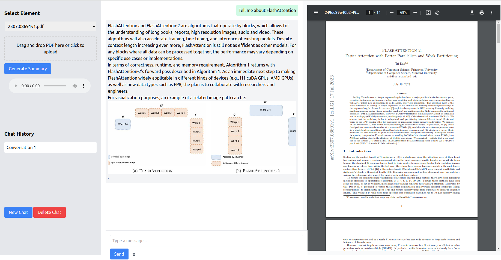

## IntelliPaper: Virtual Assistant for Research Papers




Quickly gain deep understanding on any subject. Manage thousands of research papers effortlessly with our advanced Q&A

IntelliPaper streamlines the process of exploring academic papers, allowing you to quickly grasp essential insights and gain a deep understanding of any subject. Manage and access thousands of papers effortlessly with our advanced voice enabled Q&A chatbot interface. It integrates seamlessly advanced LLMs on-premise, leveraging the power of AMD Radeon W7900 GPUs to deliver fast, accurate, and insightful responses. The tool also generates an audio podcast of the summary of the current research paper in the display. Revolutionize your research experience with IntelliPaper where efficiency meets depth.

## Installation
To install IntelliPaper we require a machine with minimum of 128GB of RAM and an AMD GPU Radeon PRO W7900. This machine need to be installed with many Generative AI libraries and a verson of flash-attention package suitable for the AMD GPU Radeon PRO W7900. The following sub-sections presents the steps to install the necessary python packages: 

### Install PyTorch for 6.2
Create a fresh conda environment with minimal libraries: Python3.10(or higher Python3.11 ), matplotlib, JupeterLab
After the conda enironment is created the next step is to install the PyTorch Libary for ROCm from the [PyTorch portal](https://pytorch.org/). The pip command to install the latest PyTorch library for ROCm6.2.4 is:
```bash
pip3 install torch torchvision torchaudio --index-url https://download.pytorch.org/whl/rocm6.2
```
Details of pytorch installation can be found from the command:
```bash
 python3 -m torch.utils.collect_env
```

Setup up the following environment varibles:
```bash
export AMDGPU_TARGETS="gfx1100;gfx1101;gfx1102" 
export PYTORCH_ROCM_ARCH=gfx1100
export GFX_ARCH=gfx1100
export ROCM_VERSION=6.2
export GPU_TARGETS=gfx11
export HIP_VISIBLE_DEVICES=0
export TORCH_ROCM_AOTRITON_ENABLE_EXPERIMENTAL=1
export ROCM_PATH=/opt/rocm-6.2.1
export PATH=$PATH:/opt/rocm-6.2.1/bin
```

### Install Optimum-AMD for accessing Hugggingface Libraries
For installing advanced LLM models from HuggingFace portal the package Optimum-AMD package is required:
[Find out more about these integrations in the documentation](https://huggingface.co/docs/optimum/main/en/amd/amdgpu/overview)!
```bash
pip install --upgrade-strategy eager optimum[amd]      
``` 

After installing PyTorch, and Optimum-AMD packages, the system will be ready to deploy advanced LLM models through HuggingFace and the package Ollama. The latest nightly build of pytorch also include Flash Attention 2 through ROCM verion of Triton. 
       
### Installing Ollama:
Ollama interface can deploy  many LLMs to use in systems with AMD GPUs. The installation of Ollama can be done by running a single command: 
```bash
curl -fsSL https://ollama.com/install.sh | sh
```
The details of Ollama installation and the list of LLMs that can be deployed are given in the link [Ollama](https://github.com/ollama/ollama/tree/main)

For our work, we deployed the following models: Llama3.1 70B, Azure Phi3 medium(14B), 
The model llama3.1 (70B) is deployed in the system using the following command:
```bash       
ollama run llama3.1:70b
```
However, user can deploy various other LLMs which are availible throught ollama for example: internLM-20b or Phi3.5.

### Installing Whisper (medium size)
For installing the Speech-to-Text model Whisper model we followed the instructions [ROCm Whisper]( https://rocm.blogs.amd.com/artificial-intelligence/whisper/README.html)

## Deploying IntelliPaper  

### Installing in local directory
1. Clone this repository
    ```bash
    git clone https://github.com:syed-hamza/PdfReader.git
    cd PdfReader
    ```
2. Install the required Python packages
    ```bash
    cd app
    pip install -r requirements.txt
    ```
3. Run the application
    ```bash
    python ./app.py
    ```
4. Launch the IntelliPaper dashboard
   http://127.1.1.0:5000

### Installing through Docker
IntelliPaper build can be done through Docker using the command \
    ```
    docker build -t pdfr .
    ``` 
    
The docker build command will create a container with PyTorch, Optimum-AMD, and IntelliApp code. 
The command to run the container is  \
    ``` 
    docker run -p 5000:5000 --network="host" -it pdfr
    ```
    
## IntelliPaper User guide
IntelliPaper dashboard has three panels:
1) Left side panel is uploading a research paper,
2) Middle panel is for viewing the paper summary,
3) Right panel is for browsing the pdf version of the research paper.

Generate Summary button generates the summary of the entire research paper using the Llama 3.1 (70B) model deployed in Ollama framework. The generated Summary is presented in the middle panel. The Audio button presents the narrative of the research paper summary. The yellow marker moves to show the location of the text in the speech.
The middle panel also has a QnA chatbot interface. Here users can ask questions regarding the uploaded research paper. For example, user can query "What is Flash Attention 2?". This chat interface is also can be operated using voice comand. 


## Contributing
If you have any suggestions or find any issues, please create an issue or submit a pull request.

## License
This project is licensed under the MIT License. See the [LICENSE](Licence) file for details.

## Acknowledgements

Feel free to reach out if you have any questions or need further assistance!
